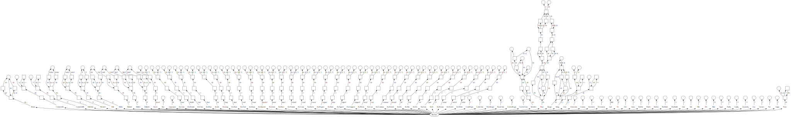

# Syntax 🗃️

## Traits 🧬
> Trait: bitset giving a description of the token type
```cpp
// From trait.hpp
// Trait Layout
// C: Class bit
// G: Group bit
// T: N bit (discriminant bit)
// Each trait is 32 bits long {Class: 6 bits, Group: 14 bits, N: 12 bits}
// C|C|C|C|C|C|G|G|G|G|G|G|G|G|G|G|G|G|G|N|N|N|N|N|N|N|N|N|N|N|N|N
```

### Meta
> **Ignored** tokens on parsing stage

| Name      | Regex          | Group   | N |
|-----------|----------------|---------|---|
| None      | `~/_`          | Npc     | 0 |
| Blank     | `{_\|'@'}+`    | Npc     | 1 |
| End       |                | Npc     | 2 |
| CommentSL | `'//' ~ '\n'`  | Comment | 0 |
| CommentML | `'/*' ~ '*/''` | Comment | 1 |
	
### Keyword
> **Reserved Tokens**

| Name       | Regex                 | Group            | N  |
|------------|-----------------------|------------------|----|
| KwSizeof   | `'sizeof' / {o\|_}`   | None             | 0  |
| KwAuto     | `'auto' / {o\|_}`     | Type             | 0  |
| KwDouble   | `'double' / {o\|_}`   | Type             | 1  |
| KwChar     | `'char' / {o\|_}`     | Type             | 2  |
| KwFloat    | `'float' / {o\|_}`    | Type             | 3  |
| KwInt      | `'int' / {o\|_}`      | Type             | 4  |
| KwVoid     | `'void' / {o\|_}`     | Type             | 5  |
| KwLong     | `'long' / {o\|_}`     | Type \| Modifier | 0  |
| KwShort    | `'short' / {o\|_}`    | Type \| Modifier | 1  |
| KwEnum     | `'enum' / {o\|_}`     | Define           | 0  |
| KwTypedef  | `'typedef' / {o\|_}`  | Define           | 1  |
| KwUnion    | `'union' / {o\|_}`    | Define           | 2  |
| KwStruct   | `'struct' / {o\|_}`   | Define           | 3  |
| KwVolatile | `'volatile' / {o\|_}` | Modifier         | 0  |
| KwConst    | `'const' / {o\|_}`    | Modifier         | 1  |
| KwExtern   | `'extern' / {o\|_}`   | Modifier         | 2  |
| KwRegister | `'register' / {o\|_}` | Modifier         | 3  |
| KwStatic   | `'static' / {o\|_}`   | Modifier         | 4  |
| KwSigned   | `'signed' / {o\|_}`   | Modifier         | 5  |
| KwUnsigned | `'unsigned' / {o\|_}` | Modifier         | 6  |
| KwBreak    | `'break' / {o\|_}`    | Flow             | 0  |
| KwCase     | `'case' / {o\|_}`     | Flow             | 1  |
| KwContinue | `'continue' / {o\|_}` | Flow             | 2  |
| KwDefault  | `'default' / {o\|_}`  | Flow             | 3  |
| KwDo       | `'do' / {o\|_}`       | Flow             | 4  |
| KwElse     | `'else' / {o\|_}`     | Flow             | 5  |
| KwFor      | `'for' / {o\|_}`      | Flow             | 6  |
| KwGoto     | `'goto' / {o\|_}`     | Flow             | 7  |
| KwIf       | `'if' / {o\|_}`       | Flow             | 8  |
| KwReturn   | `'return' / {o\|_}`   | Flow             | 9  |
| KwSwitch   | `'switch' / {o\|_}`   | Flow             | 10 |
| KwWhile    | `'while' / {o\|_}`    | Flow             | 11 |
	
### Bracket
| Name         | Regex | Group | N |
|--------------|-------|-------|---|
| CurlyBegin   | `'{'` | None  | 0 |
| CurlyClose   | `'}'` | None  | 1 |
| ParenBegin   | `'('` | None  | 2 |
| ParenClose   | `')'` | None  | 3 |
| CrochetBegin | `']'` | None  | 4 |
| CrochetClose | `'['` | None  | 5 |

### Operator
| Name      | Regex    | Group                | N |
|-----------|----------|----------------------|---|
| Increment | `'++'`   | None                 | 0 |
| Decrement | `'--'`   | None                 | 1 |
| Assign    | `'='`    | Binary               | 0 |
| Not       | `'!'`    | Logic                | 0 |
| And       | `'&&'`   | Logic \| Binary      | 0 |
| Or        | `'\|\|'` | Logic \| Binary      | 1 |
| Add       | `'+'`    | Arithmetic \| Binary | 0 |
| Sub       | `'-'`    | Arithmetic \| Binary | 1 |
| Div       | `'/'`    | Arithmetic \| Binary | 2 |
| Mod       | `'%'`    | Arithmetic \| Binary | 3 |
| BinNot    | `'~'`    | Bin                  | 0 |
| BinOr     | `'\|'`   | Bin \| Binary        | 0 |
| BinXor    | `'^'`    | Bin \| Binary        | 1 |
| BinShiftL | `'<<'`   | Bin \| Binary        | 2 |
| BinShiftR | `'>>'`   | Bin \| Binary        | 3 |
| Equal     | `'=='`   | Compare \| Binary    | 0 |
| NotEq     | `'!='`   | Compare \| Binary    | 1 |
| Less      | `'<'`    | Compare \| Binary    | 2 |
| Greater   | `'>'`    | Compare \| Binary    | 3 |
| LessEq    | `'<='`   | Compare \| Binary    | 4 |
| GreaterEq | `'>='`   | Compare \| Binary    | 5 |
| Ampersand | `'&'`    | Access               | 0 |
| Dot       | `'.'`    | Access               | 1 |
| Arrow     | `'->'`   | Access               | 2 |
| Semicolon | `';'`    | None                 | 0 |
| Comma     | `','`    | None                 | 1 |
	
### Data	
| Name       | Regex                                         | Group    | N |
|------------|-----------------------------------------------|----------|---|
| Identifier | `{a\|'_'} {a\|'_'\|n}*`                       | None     | 0 |
| Float      | `{'+'\|'-'}* {n* '.' n+} \| {n+ '.' n*} 'f'?` | Constant | 0 |
| Integer    | `{'+'\|'-'}* n+`                              | Constant | 1 |
| String     | `Q ~ {'\n' \| Q}`                             | Constant | 2 |
| Char       | `q ~ q`                                       | Constant | 3 |
	

### Polymorphic
> Represents tokens with **different meanings** based out of the context

| Name      | Regex               | Class               | Group                                      | Aliases               |
|-----------|---------------------|---------------------|--------------------------------------------|-----------------------|
| Sizeof    | `'sizeof' / {o\|_}` | Keyword \| Operator |                                            |                       |
| Pointer   | `'*'`               | Operator \| Keyword | Access \| Modifier \| Arithmetic \| Binary | Deref, KwPointer, Mul |
| Ampersand | `'&'`               | Operator            | Access \| Bin \| Binary                    | Address, BinAnd       |

## Machine
> The algorithm behind ccc is simple, the first match gives us the source and the trait.\
> \[current, end\[ source is submitted to each of the regular expressions in a precise order.

### The machine graph representation (Commit #492c531)

